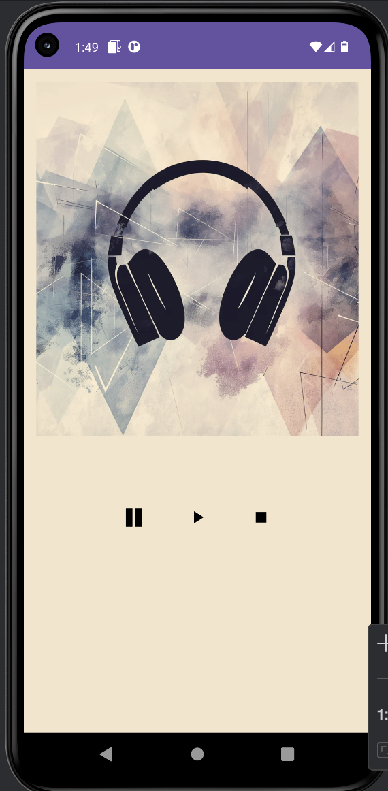
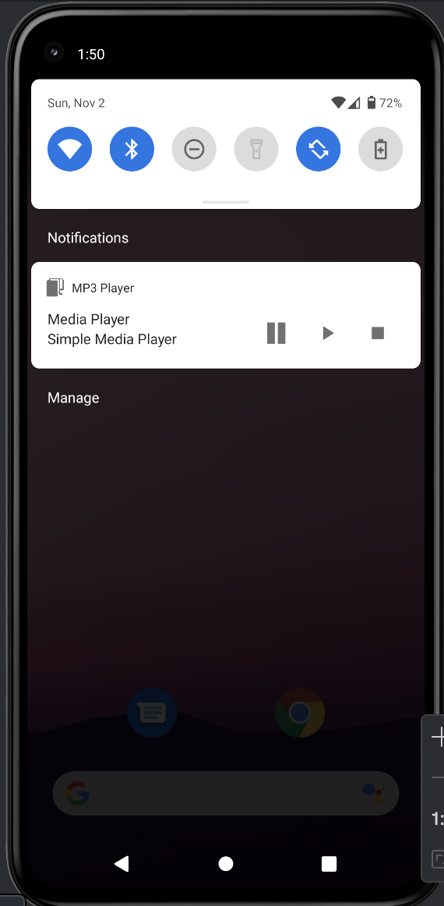

# 🎵 MP3 Player App

A simple Android application that plays MP3 music in the **background** using Android components like **MediaPlayer**, **Service**, **Notification**, and **BroadcastReceiver**.  
This project demonstrates how to keep audio playback running even when the app is closed, and how to catch system events such as **LOW_BATTERY**.

---

## 📱 Screenshots

<p align="center">
  
  
</p>

*(👉 Replace these image names with your actual screenshots if necessary.)*

---

## 🧩 Features

- 🎶 Play MP3 audio in the background
- ⚙️ Uses **Service** for continuous playback
- 🔔 Shows **Notification** with play/pause controls
- 🔋 Detects **LOW_BATTERY** event via **BroadcastReceiver**
- 🪄 Simple and beginner-friendly structure

---

## ⚙️ Technologies Used

| Component | Description |
|------------|--------------|
| **MediaPlayer** | Handles MP3 playback |
| **Service** | Runs the music in the background |
| **Notification + PendingIntent** | Provides playback control from the status bar |
| **BroadcastReceiver** | Listens for device events like low battery |
| **Intent Actions** | Used for Play / Pause / Stop functionality |

---

## 🚀 How to Run

1. Clone this repository:
   ```bash
   git clone https://github.com/ismoil201/MP3-player.git
